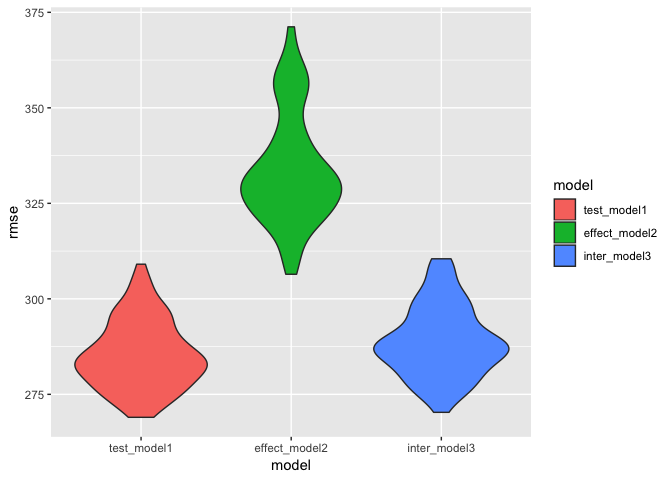

Homework 6
================
Annie Yu xy2404
11/22/2018

Problem 1
=========

#### Cleaning the data and add variable....

``` r
homicide <- read_csv('./data/homicide-data.csv') %>% 
  janitor::clean_names() %>%
  mutate(city_state = str_c(city, ",", state)) %>% 
  filter(city_state!='Dallas,TX',
         city_state!='Phoenix,AZ',
         city_state!='Kansas City,MO',
         city_state!='Tulsa,AL') %>%
  mutate(resolved = as.numeric(disposition == "Closed by arrest"),
         victim_race = as.factor(victim_race),
         victim_age = as.numeric(victim_age)) %>% 
  mutate(victim_race = fct_recode(victim_race, non_white = 'Asian', non_white = 'Black', non_white = 'Hispanic', non_white = 'Other', non_white = 'Unknown', white = 'White')) %>% 
  mutate(victim_race = fct_relevel(victim_race,'white'))
```

First, I clean the dataset, Then I create new variable for city\_state and make the data tidy. such as filter some variables I do not use. The dataset contains uid, reported\_date, victim\_last, victim\_first, victim\_race, victim\_age, victim\_sex, city, state, lat, lon, disposition, city\_state, resolved variables. And the dataset is stored in the dataframe, which has 48507 rows and 14 columns.

#### For the city of Baltimore, MD....

``` r
bal_homicide <- homicide %>% 
  filter(city_state == 'Baltimore,MD') %>% 
  select(resolved, victim_race, victim_age, victim_sex) 

  bal_glm <- glm(resolved ~ victim_age + victim_race + victim_sex, data = bal_homicide, family = binomial())
  

save(bal_glm, file = "./bal_homicide.rdata")
  
bal_glm %>% 
  broom::tidy() %>% 
  mutate(OR = exp(estimate),
         log_OR = estimate,
         OR_lower = exp(estimate - std.error*1.96),
         OR_upper = exp(estimate + std.error*1.96)) %>% 
  select(c(term, log_OR, OR, p.value, OR_lower, OR_upper)) %>% 
  knitr::kable()
```

| term                   |     log\_OR|         OR|    p.value|  OR\_lower|  OR\_upper|
|:-----------------------|-----------:|----------:|----------:|----------:|----------:|
| (Intercept)            |   1.1860305|  3.2740589|  0.0000004|  2.0671700|  5.1855735|
| victim\_age            |  -0.0069900|  0.9930344|  0.0321594|  0.9867043|  0.9994050|
| victim\_racenon\_white |  -0.8195997|  0.4406080|  0.0000027|  0.3129079|  0.6204234|
| victim\_sexMale        |  -0.8877869|  0.4115656|  0.0000000|  0.3152280|  0.5373452|

For the city of Baltimore, MD, I want to know whether there are assoicaiton between resolved and other predictors (victim age, sex and race), I use the glm function to fit the logistic regression. After setting the glm function. I save the output as bal\_homicide.rdata. Then apply the broom::tidy to this object; and obtain the estimate and confidence interval of the adjusted odds ratio for solving homicides comparing non-white victims to white victims keeping all other variables fixed.

#### Calculating for each city....

``` r
glmfunction = function(x){
  
  glm_city <- glm(resolved ~ victim_age + victim_race + victim_sex, data = x, family = binomial())
  
  glm_city %>% 
    broom::tidy() %>% 
    mutate(OR = exp(estimate),
         log_OR = estimate,
         OR_lower = exp(estimate - std.error*1.96),
         OR_upper = exp(estimate + std.error*1.96)) %>% 
    select(c(term, log_OR, OR, p.value, OR_lower, OR_upper))
}

all_city <- nest(homicide, -city_state) %>% 
  mutate(adjust_or = map(data, glmfunction))%>% 
  select(city_state, adjust_or) %>% 
  unnest %>% 
  filter(term=='victim_racenon_white')
 
knitr::kable(all_city)
```

| city\_state       | term                   |     log\_OR|         OR|    p.value|  OR\_lower|  OR\_upper|
|:------------------|:-----------------------|-----------:|----------:|----------:|----------:|----------:|
| Albuquerque,NM    | victim\_racenon\_white |  -0.2991208|  0.7414698|  0.2377043|  0.4512868|  1.2182443|
| Atlanta,GA        | victim\_racenon\_white |  -0.2839530|  0.7528020|  0.3172864|  0.4315063|  1.3133316|
| Baltimore,MD      | victim\_racenon\_white |  -0.8195997|  0.4406080|  0.0000027|  0.3129079|  0.6204234|
| Baton Rouge,LA    | victim\_racenon\_white |  -0.4040228|  0.6676289|  0.2963820|  0.3127439|  1.4252185|
| Birmingham,AL     | victim\_racenon\_white |   0.0385265|  1.0392783|  0.8855421|  0.6150483|  1.7561211|
| Boston,MA         | victim\_racenon\_white |  -2.1667164|  0.1145531|  0.0000017|  0.0471531|  0.2782939|
| Buffalo,NY        | victim\_racenon\_white |  -0.9418961|  0.3898879|  0.0023055|  0.2127526|  0.7145036|
| Charlotte,NC      | victim\_racenon\_white |  -0.5842897|  0.5575017|  0.0382543|  0.3207914|  0.9688794|
| Chicago,IL        | victim\_racenon\_white |  -0.5761032|  0.5620844|  0.0000207|  0.4311321|  0.7328123|
| Cincinnati,OH     | victim\_racenon\_white |  -1.1445849|  0.3183560|  0.0000428|  0.1839996|  0.5508195|
| Columbus,OH       | victim\_racenon\_white |  -0.1570014|  0.8547029|  0.3029547|  0.6339868|  1.1522590|
| Denver,CO         | victim\_racenon\_white |  -0.5076856|  0.6018870|  0.0541782|  0.3589787|  1.0091626|
| Detroit,MI        | victim\_racenon\_white |  -0.4288684|  0.6512456|  0.0036337|  0.4877782|  0.8694953|
| Durham,NC         | victim\_racenon\_white |   0.0028136|  1.0028175|  0.9951589|  0.4041085|  2.4885469|
| Fort Worth,TX     | victim\_racenon\_white |  -0.1769334|  0.8378356|  0.4007906|  0.5545077|  1.2659311|
| Fresno,CA         | victim\_racenon\_white |  -0.8034052|  0.4478015|  0.0176545|  0.2306060|  0.8695617|
| Houston,TX        | victim\_racenon\_white |  -0.1362727|  0.8726047|  0.2295200|  0.6986847|  1.0898176|
| Indianapolis,IN   | victim\_racenon\_white |  -0.6840764|  0.5045560|  0.0000015|  0.3817941|  0.6667909|
| Jacksonville,FL   | victim\_racenon\_white |  -0.4182842|  0.6581751|  0.0024149|  0.5023197|  0.8623880|
| Las Vegas,NV      | victim\_racenon\_white |  -0.2804869|  0.7554159|  0.0299233|  0.5864306|  0.9730958|
| Long Beach,CA     | victim\_racenon\_white |  -0.2307939|  0.7939031|  0.5280169|  0.3876546|  1.6258857|
| Los Angeles,CA    | victim\_racenon\_white |  -0.4067023|  0.6658424|  0.0131181|  0.4828459|  0.9181936|
| Louisville,KY     | victim\_racenon\_white |  -0.9367139|  0.3919136|  0.0000094|  0.2589809|  0.5930794|
| Memphis,TN        | victim\_racenon\_white |  -0.2454925|  0.7823191|  0.2303081|  0.5238191|  1.1683866|
| Miami,FL          | victim\_racenon\_white |  -0.5512363|  0.5762370|  0.0107597|  0.3772438|  0.8801975|
| Milwaukee,wI      | victim\_racenon\_white |  -0.4582502|  0.6323892|  0.0457473|  0.4033912|  0.9913854|
| Minneapolis,MN    | victim\_racenon\_white |  -0.4374158|  0.6457029|  0.1718976|  0.3447349|  1.2094287|
| Nashville,TN      | victim\_racenon\_white |  -0.1069270|  0.8985913|  0.5107693|  0.6533730|  1.2358427|
| New Orleans,LA    | victim\_racenon\_white |  -0.7637119|  0.4659337|  0.0010824|  0.2947205|  0.7366105|
| New York,NY       | victim\_racenon\_white |  -0.6321289|  0.5314592|  0.0540473|  0.2793572|  1.0110671|
| Oakland,CA        | victim\_racenon\_white |  -1.5465668|  0.2129779|  0.0000214|  0.1043603|  0.4346441|
| Oklahoma City,OK  | victim\_racenon\_white |  -0.3838211|  0.6812533|  0.0337141|  0.4780242|  0.9708841|
| Omaha,NE          | victim\_racenon\_white |  -1.7783134|  0.1689228|  0.0000000|  0.0935132|  0.3051432|
| Philadelphia,PA   | victim\_racenon\_white |  -0.4403262|  0.6438263|  0.0021085|  0.4862491|  0.8524692|
| Pittsburgh,PA     | victim\_racenon\_white |  -1.2674074|  0.2815606|  0.0000093|  0.1607457|  0.4931788|
| Richmond,VA       | victim\_racenon\_white |  -0.8042697|  0.4474146|  0.1214624|  0.1616764|  1.2381512|
| San Antonio,TX    | victim\_racenon\_white |  -0.3720067|  0.6893496|  0.0694756|  0.4613199|  1.0300939|
| Sacramento,CA     | victim\_racenon\_white |  -0.2475177|  0.7807364|  0.3812291|  0.4486304|  1.3586894|
| Savannah,GA       | victim\_racenon\_white |  -0.5168361|  0.5964045|  0.1802729|  0.2800315|  1.2702083|
| San Bernardino,CA | victim\_racenon\_white |  -0.1276678|  0.8801457|  0.7564200|  0.3928312|  1.9719832|
| San Diego,CA      | victim\_racenon\_white |  -0.7270019|  0.4833560|  0.0032977|  0.2976277|  0.7849839|
| San Francisco,CA  | victim\_racenon\_white |  -0.7802724|  0.4582812|  0.0007982|  0.2904504|  0.7230896|
| St. Louis,MO      | victim\_racenon\_white |  -0.5498302|  0.5770478|  0.0021851|  0.4059333|  0.8202928|
| Stockton,CA       | victim\_racenon\_white |  -0.9789109|  0.3757201|  0.0030932|  0.1964244|  0.7186762|
| Tampa,FL          | victim\_racenon\_white |   0.1474076|  1.1588262|  0.6709560|  0.5870394|  2.2875435|
| Tulsa,OK          | victim\_racenon\_white |  -0.5067195|  0.6024687|  0.0084916|  0.4130931|  0.8786605|
| Washington,DC     | victim\_racenon\_white |  -0.6731847|  0.5100815|  0.0532959|  0.2577041|  1.0096200|

Creating a function to run glm for each of the cities in my dataset, and extract the adjusted odds ratio (and CI) for solving homicides comparing non-white victims to white victims. The smaller the adjusted OR suggests more race discrimination in resolving homicides.

#### Create a plot that shows the estimated ORs and CIs for each city

``` r
all_city %>% 
ggplot(aes(x = reorder(city_state, -OR), y=OR,fill = city_state))+
  geom_bar(stat = 'identity', alpha = 1)+
  geom_errorbar(mapping=aes(x= city_state, ymin=OR_lower, ymax=OR_upper))+
  theme(legend.position = "none", axis.text.x = element_text(angle = 90, hjust = 1), legend.key.width = unit(0.15,'cm')) +
  labs(
    x = "City_State",
    y = "Adjusted Odds Ratio with 95% CIs"
  )
```


``` r
  ggtitle('Adjusted Odds Ratio with 95% CIs for each city')
```

    ## $title
    ## [1] "Adjusted Odds Ratio with 95% CIs for each city"
    ## 
    ## attr(,"class")
    ## [1] "labels"

I create the bar diagram to show the difference OR for each city. From this plot, we could conclude Boston has least race discrimination while Tempa has the highest race discrimation.

Problem 2
=========

``` r
birthweight<- read_csv('./data/birthweight.csv') %>% 
  janitor::clean_names() %>%
  mutate(babysex = as.factor(babysex),
         frace = as.factor(frace),
         malform = as.factor(malform),
         mrace = as.factor(mrace))

skimr::skim(birthweight)
```

    ## Skim summary statistics
    ##  n obs: 4342 
    ##  n variables: 20 
    ## 
    ## ── Variable type:factor ───────────────────────────────────────────────────────────────────────────────────
    ##  variable missing complete    n n_unique                      top_counts
    ##   babysex       0     4342 4342        2         1: 2230, 2: 2112, NA: 0
    ##     frace       0     4342 4342        5 1: 2123, 2: 1911, 4: 248, 3: 46
    ##   malform       0     4342 4342        2           0: 4327, 1: 15, NA: 0
    ##     mrace       0     4342 4342        4 1: 2147, 2: 1909, 4: 243, 3: 43
    ##  ordered
    ##    FALSE
    ##    FALSE
    ##    FALSE
    ##    FALSE
    ## 
    ## ── Variable type:integer ──────────────────────────────────────────────────────────────────────────────────
    ##  variable missing complete    n      mean     sd  p0  p25    p50  p75 p100
    ##     bhead       0     4342 4342   33.65     1.62  21   33   34     35   41
    ##   blength       0     4342 4342   49.75     2.72  20   48   50     51   63
    ##       bwt       0     4342 4342 3114.4    512.15 595 2807 3132.5 3459 4791
    ##     delwt       0     4342 4342  145.57    22.21  86  131  143    157  334
    ##   fincome       0     4342 4342   44.11    25.98   0   25   35     65   96
    ##  menarche       0     4342 4342   12.51     1.48   0   12   12     13   19
    ##   mheight       0     4342 4342   63.49     2.66  48   62   63     65   77
    ##    momage       0     4342 4342   20.3      3.88  12   18   20     22   44
    ##    parity       0     4342 4342    0.0023   0.1    0    0    0      0    6
    ##   pnumlbw       0     4342 4342    0        0      0    0    0      0    0
    ##   pnumsga       0     4342 4342    0        0      0    0    0      0    0
    ##      ppwt       0     4342 4342  123.49    20.16  70  110  120    134  287
    ##    wtgain       0     4342 4342   22.08    10.94 -46   15   22     28   89
    ##      hist
    ##  ▁▁▁▁▅▇▁▁
    ##  ▁▁▁▁▁▇▁▁
    ##  ▁▁▁▃▇▇▂▁
    ##  ▁▇▅▁▁▁▁▁
    ##  ▁▂▇▂▂▂▁▃
    ##  ▁▁▁▁▂▇▁▁
    ##  ▁▁▁▅▇▂▁▁
    ##  ▂▇▅▂▁▁▁▁
    ##  ▇▁▁▁▁▁▁▁
    ##  ▁▁▁▇▁▁▁▁
    ##  ▁▁▁▇▁▁▁▁
    ##  ▁▇▆▁▁▁▁▁
    ##  ▁▁▁▇▇▁▁▁
    ## 
    ## ── Variable type:numeric ──────────────────────────────────────────────────────────────────────────────────
    ##  variable missing complete    n  mean   sd    p0   p25   p50   p75 p100
    ##   gaweeks       0     4342 4342 39.43 3.15 17.7  38.3  39.9  41.1  51.3
    ##     ppbmi       0     4342 4342 21.57 3.18 13.07 19.53 21.03 22.91 46.1
    ##    smoken       0     4342 4342  4.15 7.41  0     0     0     5    60  
    ##      hist
    ##  ▁▁▁▁▃▇▁▁
    ##  ▁▇▅▁▁▁▁▁
    ##  ▇▁▁▁▁▁▁▁

``` r
# The full model is:
fullmodel <- lm(bwt ~ ., data = birthweight)
summary(fullmodel)
```

    ## 
    ## Call:
    ## lm(formula = bwt ~ ., data = birthweight)
    ## 
    ## Residuals:
    ##      Min       1Q   Median       3Q      Max 
    ## -1097.68  -184.86    -3.33   173.09  2344.15 
    ## 
    ## Coefficients: (3 not defined because of singularities)
    ##               Estimate Std. Error t value Pr(>|t|)    
    ## (Intercept) -6265.3914   660.4011  -9.487  < 2e-16 ***
    ## babysex2       28.7073     8.4652   3.391 0.000702 ***
    ## bhead         130.7781     3.4523  37.881  < 2e-16 ***
    ## blength        74.9536     2.0217  37.075  < 2e-16 ***
    ## delwt           4.1007     0.3948  10.386  < 2e-16 ***
    ## fincome         0.2898     0.1795   1.614 0.106551    
    ## frace2         14.3313    46.1501   0.311 0.756168    
    ## frace3         21.2361    69.2960   0.306 0.759273    
    ## frace4        -46.9962    44.6782  -1.052 0.292912    
    ## frace8          4.2969    74.0741   0.058 0.953745    
    ## gaweeks        11.5494     1.4654   7.882 4.06e-15 ***
    ## malform1        9.7650    70.6259   0.138 0.890039    
    ## menarche       -3.5508     2.8951  -1.226 0.220083    
    ## mheight         9.7874    10.3116   0.949 0.342588    
    ## momage          0.7593     1.2221   0.621 0.534418    
    ## mrace2       -151.4354    46.0453  -3.289 0.001014 ** 
    ## mrace3        -91.3866    71.9190  -1.271 0.203908    
    ## mrace4        -56.4787    45.1369  -1.251 0.210901    
    ## parity         95.5411    40.4793   2.360 0.018307 *  
    ## pnumlbw             NA         NA      NA       NA    
    ## pnumsga             NA         NA      NA       NA    
    ## ppbmi           4.3538    14.8913   0.292 0.770017    
    ## ppwt           -3.4716     2.6121  -1.329 0.183913    
    ## smoken         -4.8544     0.5871  -8.269  < 2e-16 ***
    ## wtgain              NA         NA      NA       NA    
    ## ---
    ## Signif. codes:  0 '***' 0.001 '**' 0.01 '*' 0.05 '.' 0.1 ' ' 1
    ## 
    ## Residual standard error: 272.5 on 4320 degrees of freedom
    ## Multiple R-squared:  0.7183, Adjusted R-squared:  0.717 
    ## F-statistic: 524.6 on 21 and 4320 DF,  p-value: < 2.2e-16

I clean the dataset firstly, Then I change the character of variables and make the data tidy. The dataset contains babysex, bhead, blength, bwt, delwt, fincome, frace, gaweeks, malform, menarche, mheight, momage, mrace, parity, pnumlbw, pnumsga, ppbmi, ppwt, smoken, wtgain variables. And the dataset is stored in the dataframe, which has 4342 rows and 20 columns. I want to explore the association between bwt and other all predictors, I use the lm function to find it.

#### Hypothesis:

*Y* = *β*<sub>0</sub> + *β*<sub>1</sub> \* (*x*<sub>1</sub>)*b**a**b**y**s**e**x* + *β*<sub>2</sub> \* (*x*<sub>2</sub>)*b**h**e**a**d* + *β*<sub>3</sub> \* (*x*<sub>3</sub>)*b**l**e**n**g**t**h* + *β*<sub>4</sub> \* (*x*<sub>4</sub>)*w**t**g**a**i**n* + *β*<sub>5</sub> \* (*x*<sub>5</sub>)*s**m**o**k**e**n*

#### Test the model:

``` r
model1 <- lm(bwt ~ babysex + bhead + blength + wtgain +smoken, data = birthweight )
summary(model1)
```

    ## 
    ## Call:
    ## lm(formula = bwt ~ babysex + bhead + blength + wtgain + smoken, 
    ##     data = birthweight)
    ## 
    ## Residuals:
    ##      Min       1Q   Median       3Q      Max 
    ## -1159.99  -191.73    -8.25   177.99  2665.49 
    ## 
    ## Coefficients:
    ##               Estimate Std. Error t value Pr(>|t|)    
    ## (Intercept) -5995.9685    97.7220 -61.357  < 2e-16 ***
    ## babysex2       40.2497     8.8027   4.572 4.96e-06 ***
    ## bhead         145.3284     3.4888  41.656  < 2e-16 ***
    ## blength        82.8886     2.0624  40.190  < 2e-16 ***
    ## wtgain          3.7679     0.4052   9.299  < 2e-16 ***
    ## smoken         -1.5890     0.5874  -2.705  0.00685 ** 
    ## ---
    ## Signif. codes:  0 '***' 0.001 '**' 0.01 '*' 0.05 '.' 0.1 ' ' 1
    ## 
    ## Residual standard error: 285.6 on 4336 degrees of freedom
    ## Multiple R-squared:  0.6895, Adjusted R-squared:  0.6891 
    ## F-statistic:  1926 on 5 and 4336 DF,  p-value: < 2.2e-16

``` r
birthweight %>% 
  add_predictions(model1) %>% 
  add_residuals(model1) %>%
  rename(prediction = pred,
         residuals = resid) %>% 
  ggplot(aes(x = prediction, y = residuals))+
  geom_point(aes(alpha=.2))+
  labs(
    x = "Prediction",
    y = "Residuals"
  )+
  ggtitle('Model Residuals Against Fitted Values')
```


The hypothesis is explore the relationship for predictors (babysex, bhead, blength, wtgain, smoken) and birthweight. The add the predictions and residual to explore the trend and make the point diagram to conclude it. Residuals form a horizontal (linear) ‘band’ around zero. However, there are some potential outliers in the lower range of birthweight on the left.

#### Compare other two models...

``` r
#One using length at birth and gestational age as predictors (main effects only)
model2 <-lm(bwt ~ blength + gaweeks, data = birthweight)

#One using head circumference, length, sex, and all interactions (including the three-way interaction) between these
model3<-lm(bwt ~ bhead + blength + babysex + bhead * blength * babysex, data = birthweight)

cverror <- birthweight %>% 
  crossv_mc(100) %>% 
  mutate(train = map(train, as.tibble),
         test = map(test, as.tibble)) %>% 
  mutate(test_model1 = map(train, ~lm(bwt ~ babysex + bhead + blength + wtgain +smoken, data =.x)),
         effect_model2 =map(train, ~lm(bwt ~ blength + gaweeks, data=.x)),
         inter_model3 = map(train, ~lm(bwt ~ bhead + blength + babysex + bhead * blength * babysex, data=.x))) %>% 
  mutate(rmse_test_model1 = map2_dbl(test_model1,test, ~rmse(model = .x, data=.y)),
         rmse_effect_model2 = map2_dbl(effect_model2,test, ~rmse(model = .x, data=.y)),
         rmse_inter_model3 = map2_dbl(inter_model3,test, ~rmse(model = .x, data=.y))) %>% 
  select(starts_with("rmse")) %>% 
  gather(key = model, value = rmse) %>% 
  mutate(model=str_replace(model, "rmse_", ""),
         model = fct_inorder(model))
```

``` r
ggplot(cverror, aes(x=model, y = rmse, fill = model))+
  geom_violin()
```



In this plot, we can observe that the test\_model1 has a much lower rmse that the other two, so test\_model1 is might be a better model compared to the other two.
