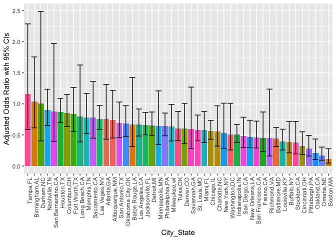

Homework 6
================
Annie Yu xy2404
11/22/2018

Problem 1
=========

#### Cleaning the data and add variable....

``` r
homicide <- read_csv('./data/homicide-data.csv') %>% 
  janitor::clean_names() %>%
  mutate(city_state = str_c(city, ",", state)) %>% 
  filter(city_state!='Dallas,TX',
         city_state!='Phoenix,AZ',
         city_state!='Kansas City,MO',
         city_state!='Tulsa,AL') %>%
  mutate(resolved = as.numeric(disposition == "Closed by arrest"),
         victim_race = as.factor(victim_race),
         victim_age = as.numeric(victim_age)) %>% 
  mutate(victim_race = fct_recode(victim_race, non_white = 'Asian', non_white = 'Black', non_white = 'Hispanic', non_white = 'Other', non_white = 'Unknown', white = 'White'))
```

    ## Warning in evalq(as.numeric(victim_age), <environment>): NAs introduced by
    ## coercion

#### For the city of Baltimore, MD....

``` r
bal_homicide <- homicide %>% 
  filter(city_state == 'Baltimore,MD') %>% 
  select(resolved, victim_race, victim_age, victim_sex) 

  bal_glm <- glm(resolved ~ victim_age + victim_race + victim_sex, data = bal_homicide, family = binomial())
  

save(bal_glm, file = "./bal_homicide.rdata")
  
bal_glm %>% 
  broom::tidy() %>% 
  mutate(OR = exp(estimate),
         log_OR = estimate,
         OR_lower = exp(estimate - std.error*1.96),
         OR_upper = exp(estimate + std.error*1.96)) %>% 
  select(c(term, log_OR, OR, p.value, OR_lower, OR_upper)) %>% 
  knitr::kable()
```

| term              |     log\_OR|         OR|    p.value|  OR\_lower|  OR\_upper|
|:------------------|-----------:|----------:|----------:|----------:|----------:|
| (Intercept)       |   0.3664307|  1.4425765|  0.0292029|  1.0377869|  2.0052545|
| victim\_age       |  -0.0069900|  0.9930344|  0.0321594|  0.9867043|  0.9994050|
| victim\_racewhite |   0.8195997|  2.2695913|  0.0000027|  1.6118026|  3.1958283|
| victim\_sexMale   |  -0.8877869|  0.4115656|  0.0000000|  0.3152280|  0.5373452|

#### Calculating for each city....

``` r
glmfunction = function(x){
  
  glm_city <- glm(resolved ~ victim_age + victim_race + victim_sex, data = x, family = binomial())
  
  glm_city %>% 
    broom::tidy() %>% 
    mutate(OR = exp(estimate),
         log_OR = estimate,
         OR_lower = exp(estimate - std.error*1.96),
         OR_upper = exp(estimate + std.error*1.96)) %>% 
    select(c(term, log_OR, OR, p.value, OR_lower, OR_upper))
}

all_city <- nest(homicide, -city_state) %>% 
  mutate(adjust_or = map(data, glmfunction))%>% 
  select(city_state, adjust_or) %>% 
  unnest  
 
as.tibble(all_city)
```

    ## # A tibble: 211 x 7
    ##    city_state     term              log_OR    OR p.value OR_lower OR_upper
    ##    <chr>          <chr>              <dbl> <dbl>   <dbl>    <dbl>    <dbl>
    ##  1 Albuquerque,NM (Intercept)       0.933  2.54  1.33e-2    1.21     5.32 
    ##  2 Albuquerque,NM victim_age       -0.0230 0.977 1.08e-3    0.964    0.991
    ##  3 Albuquerque,NM victim_racewhite  0.299  1.35  2.38e-1    0.821    2.22 
    ##  4 Albuquerque,NM victim_sexMale    0.455  1.58  1.15e-1    0.895    2.77 
    ##  5 Albuquerque,NM victim_sexUnkno…  2.10   8.19  1.86e-3    2.18    30.8  
    ##  6 Atlanta,GA     (Intercept)       0.868  2.38  2.83e-4    1.49     3.81 
    ##  7 Atlanta,GA     victim_age       -0.0118 0.988 9.81e-3    0.979    0.997
    ##  8 Atlanta,GA     victim_racewhite  0.284  1.33  3.17e-1    0.761    2.32 
    ##  9 Atlanta,GA     victim_sexMale   -0.0101 0.990 9.58e-1    0.679    1.44 
    ## 10 Baltimore,MD   (Intercept)       0.366  1.44  2.92e-2    1.04     2.01 
    ## # ... with 201 more rows

#### Create a plot that shows the estimated ORs and CIs for each city

``` r
all_city %>% 
ggplot(aes(x = reorder(city_state, -OR), y=OR))+
  geom_bar(stat = 'identity', alpha = 1)+
  #geom_errorbar(aes(x= city_state, ymin=OR_lower, ymax=OR_upper))+
  theme(legend.position = "bottom", axis.text.x = element_text(angle = 90, hjust = 1), legend.key.width = unit(0.15,'cm')) +
  labs(
    x = "City_State",
    y = "Adjusted Odds Ratio with 95% CIs"
  )
```



``` r
  ggtitle('Adjusted Odds Ratio with 95% CIs for each city')
```

    ## $title
    ## [1] "Adjusted Odds Ratio with 95% CIs for each city"
    ## 
    ## attr(,"class")
    ## [1] "labels"

Problem 2
=========

``` r
birthweight<- read_csv('./data/birthweight.csv') %>% 
  janitor::clean_names() %>%
  mutate(babysex = as.factor(babysex),
         frace = as.factor(frace),
         malform = as.factor(malform),
         mrace = as.factor(mrace))
```

    ## Parsed with column specification:
    ## cols(
    ##   .default = col_integer(),
    ##   gaweeks = col_double(),
    ##   ppbmi = col_double(),
    ##   smoken = col_double()
    ## )

    ## See spec(...) for full column specifications.

``` r
skimr::skim(birthweight)
```

    ## Skim summary statistics
    ##  n obs: 4342 
    ##  n variables: 20 
    ## 
    ## ── Variable type:factor ───────────────────────────────────────────────────────────────────────────────────
    ##  variable missing complete    n n_unique                      top_counts
    ##   babysex       0     4342 4342        2         1: 2230, 2: 2112, NA: 0
    ##     frace       0     4342 4342        5 1: 2123, 2: 1911, 4: 248, 3: 46
    ##   malform       0     4342 4342        2           0: 4327, 1: 15, NA: 0
    ##     mrace       0     4342 4342        4 1: 2147, 2: 1909, 4: 243, 3: 43
    ##  ordered
    ##    FALSE
    ##    FALSE
    ##    FALSE
    ##    FALSE
    ## 
    ## ── Variable type:integer ──────────────────────────────────────────────────────────────────────────────────
    ##  variable missing complete    n      mean     sd  p0  p25    p50  p75 p100
    ##     bhead       0     4342 4342   33.65     1.62  21   33   34     35   41
    ##   blength       0     4342 4342   49.75     2.72  20   48   50     51   63
    ##       bwt       0     4342 4342 3114.4    512.15 595 2807 3132.5 3459 4791
    ##     delwt       0     4342 4342  145.57    22.21  86  131  143    157  334
    ##   fincome       0     4342 4342   44.11    25.98   0   25   35     65   96
    ##  menarche       0     4342 4342   12.51     1.48   0   12   12     13   19
    ##   mheight       0     4342 4342   63.49     2.66  48   62   63     65   77
    ##    momage       0     4342 4342   20.3      3.88  12   18   20     22   44
    ##    parity       0     4342 4342    0.0023   0.1    0    0    0      0    6
    ##   pnumlbw       0     4342 4342    0        0      0    0    0      0    0
    ##   pnumsga       0     4342 4342    0        0      0    0    0      0    0
    ##      ppwt       0     4342 4342  123.49    20.16  70  110  120    134  287
    ##    wtgain       0     4342 4342   22.08    10.94 -46   15   22     28   89
    ##      hist
    ##  ▁▁▁▁▅▇▁▁
    ##  ▁▁▁▁▁▇▁▁
    ##  ▁▁▁▃▇▇▂▁
    ##  ▁▇▅▁▁▁▁▁
    ##  ▁▂▇▂▂▂▁▃
    ##  ▁▁▁▁▂▇▁▁
    ##  ▁▁▁▅▇▂▁▁
    ##  ▂▇▅▂▁▁▁▁
    ##  ▇▁▁▁▁▁▁▁
    ##  ▁▁▁▇▁▁▁▁
    ##  ▁▁▁▇▁▁▁▁
    ##  ▁▇▆▁▁▁▁▁
    ##  ▁▁▁▇▇▁▁▁
    ## 
    ## ── Variable type:numeric ──────────────────────────────────────────────────────────────────────────────────
    ##  variable missing complete    n  mean   sd    p0   p25   p50   p75 p100
    ##   gaweeks       0     4342 4342 39.43 3.15 17.7  38.3  39.9  41.1  51.3
    ##     ppbmi       0     4342 4342 21.57 3.18 13.07 19.53 21.03 22.91 46.1
    ##    smoken       0     4342 4342  4.15 7.41  0     0     0     5    60  
    ##      hist
    ##  ▁▁▁▁▃▇▁▁
    ##  ▁▇▅▁▁▁▁▁
    ##  ▇▁▁▁▁▁▁▁

``` r
# The full model is:
fullmodel <- lm(bwt ~ ., data = birthweight)
summary(fullmodel)
```

    ## 
    ## Call:
    ## lm(formula = bwt ~ ., data = birthweight)
    ## 
    ## Residuals:
    ##      Min       1Q   Median       3Q      Max 
    ## -1097.68  -184.86    -3.33   173.09  2344.15 
    ## 
    ## Coefficients: (3 not defined because of singularities)
    ##               Estimate Std. Error t value Pr(>|t|)    
    ## (Intercept) -6265.3914   660.4011  -9.487  < 2e-16 ***
    ## babysex2       28.7073     8.4652   3.391 0.000702 ***
    ## bhead         130.7781     3.4523  37.881  < 2e-16 ***
    ## blength        74.9536     2.0217  37.075  < 2e-16 ***
    ## delwt           4.1007     0.3948  10.386  < 2e-16 ***
    ## fincome         0.2898     0.1795   1.614 0.106551    
    ## frace2         14.3313    46.1501   0.311 0.756168    
    ## frace3         21.2361    69.2960   0.306 0.759273    
    ## frace4        -46.9962    44.6782  -1.052 0.292912    
    ## frace8          4.2969    74.0741   0.058 0.953745    
    ## gaweeks        11.5494     1.4654   7.882 4.06e-15 ***
    ## malform1        9.7650    70.6259   0.138 0.890039    
    ## menarche       -3.5508     2.8951  -1.226 0.220083    
    ## mheight         9.7874    10.3116   0.949 0.342588    
    ## momage          0.7593     1.2221   0.621 0.534418    
    ## mrace2       -151.4354    46.0453  -3.289 0.001014 ** 
    ## mrace3        -91.3866    71.9190  -1.271 0.203908    
    ## mrace4        -56.4787    45.1369  -1.251 0.210901    
    ## parity         95.5411    40.4793   2.360 0.018307 *  
    ## pnumlbw             NA         NA      NA       NA    
    ## pnumsga             NA         NA      NA       NA    
    ## ppbmi           4.3538    14.8913   0.292 0.770017    
    ## ppwt           -3.4716     2.6121  -1.329 0.183913    
    ## smoken         -4.8544     0.5871  -8.269  < 2e-16 ***
    ## wtgain              NA         NA      NA       NA    
    ## ---
    ## Signif. codes:  0 '***' 0.001 '**' 0.01 '*' 0.05 '.' 0.1 ' ' 1
    ## 
    ## Residual standard error: 272.5 on 4320 degrees of freedom
    ## Multiple R-squared:  0.7183, Adjusted R-squared:  0.717 
    ## F-statistic: 524.6 on 21 and 4320 DF,  p-value: < 2.2e-16

#### Hypothesis:

*Y* = *β*<sub>0</sub> + *β*<sub>1</sub> \* (*x*<sub>1</sub>)*b**a**b**y**s**e**x* + *β*<sub>2</sub> \* (*x*<sub>2</sub>)*b**h**e**a**d* + *β*<sub>3</sub> \* (*x*<sub>3</sub>)*b**l**e**n**g**t**h* + *β*<sub>4</sub> \* (*x*<sub>4</sub>)*w**t**g**a**i**n* + *β*<sub>5</sub> \* (*x*<sub>5</sub>)*s**m**o**k**e**n*

#### Test the model:

``` r
model1 <- lm(bwt ~ babysex + bhead + blength + wtgain +smoken, data = birthweight )
summary(model1)
```

    ## 
    ## Call:
    ## lm(formula = bwt ~ babysex + bhead + blength + wtgain + smoken, 
    ##     data = birthweight)
    ## 
    ## Residuals:
    ##      Min       1Q   Median       3Q      Max 
    ## -1159.99  -191.73    -8.25   177.99  2665.49 
    ## 
    ## Coefficients:
    ##               Estimate Std. Error t value Pr(>|t|)    
    ## (Intercept) -5995.9685    97.7220 -61.357  < 2e-16 ***
    ## babysex2       40.2497     8.8027   4.572 4.96e-06 ***
    ## bhead         145.3284     3.4888  41.656  < 2e-16 ***
    ## blength        82.8886     2.0624  40.190  < 2e-16 ***
    ## wtgain          3.7679     0.4052   9.299  < 2e-16 ***
    ## smoken         -1.5890     0.5874  -2.705  0.00685 ** 
    ## ---
    ## Signif. codes:  0 '***' 0.001 '**' 0.01 '*' 0.05 '.' 0.1 ' ' 1
    ## 
    ## Residual standard error: 285.6 on 4336 degrees of freedom
    ## Multiple R-squared:  0.6895, Adjusted R-squared:  0.6891 
    ## F-statistic:  1926 on 5 and 4336 DF,  p-value: < 2.2e-16

``` r
birthweight %>% 
  add_predictions(model1) %>% 
  add_residuals(model1) %>%
  rename(prediction = pred,
         residuals = resid) %>% 
  ggplot(aes(x = prediction, y = residuals))+
  geom_point(aes(alpha=.2))+
  labs(
    x = "Prediction",
    y = "Residuals"
  )+
  ggtitle('Model Residuals Against Fitted Values')
```


#### Compare other two models...

``` r
#One using length at birth and gestational age as predictors (main effects only)
model2 <-lm(bwt ~ blength + gaweeks, data = birthweight)

#One using head circumference, length, sex, and all interactions (including the three-way interaction) between these
model3<-lm(bwt ~ bhead + blength + babysex + bhead * blength * babysex, data = birthweight)

cverror <- birthweight %>% 
  crossv_mc(100) %>% 
  mutate(train = map(train, as.tibble),
         test = map(test, as.tibble)) %>% 
  mutate(test_model1 = map(train, ~lm(bwt ~ babysex + bhead + blength + wtgain +smoken, data =.x)),
         effect_model2 =map(train, ~lm(bwt ~ blength + gaweeks, data=.x)),
         inter_model3 = map(train, ~lm(bwt ~ bhead + blength + babysex + bhead * blength * babysex, data=.x))) %>% 
  mutate(rmse_test_model1 = map2_dbl(test_model1,test, ~rmse(model = .x, data=.y)),
         rmse_effect_model2 = map2_dbl(effect_model2,test, ~rmse(model = .x, data=.y)),
         rmse_inter_model3 = map2_dbl(inter_model3,test, ~rmse(model = .x, data=.y))) %>% 
  select(starts_with("rmse")) %>% 
  gather(key = model, value = rmse) %>% 
  mutate(model=str_replace(model, "rmse_", ""),
         model = fct_inorder(model))
```

``` r
ggplot(cverror, aes(x=model, y = rmse, fill = model))+
  geom_violin()
```


